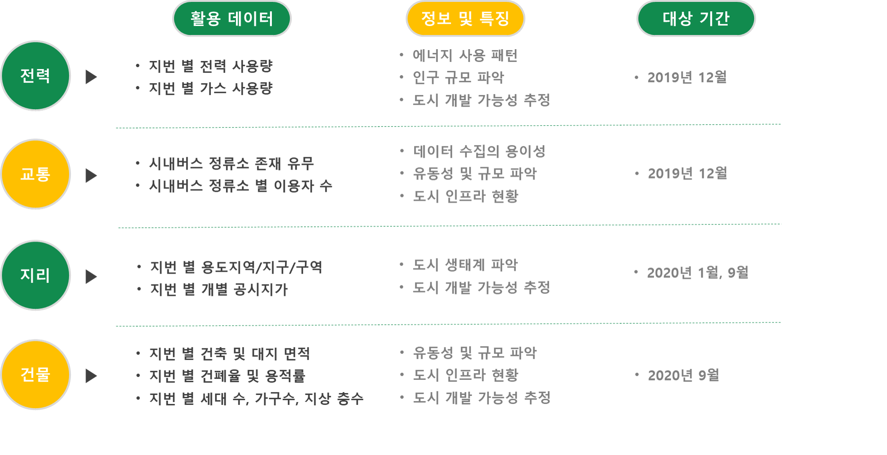

Best Use Recommendation Model for Undesignated and Unsubdivided Areas
=======================================
### 제2회 대구 빅데이터 경진대회  
Notification: [link](https://www.dip.or.kr/home/notice/boardRead.ubs?sfpsize=20&sfcategory=&fboardcd=notice&sfclassification=&sfkind=&sfsearch=ftitle&sfkeyword=%EB%8C%80%EA%B5%AC+%EB%B9%85%EB%8D%B0%EC%9D%B4%ED%84%B0&fboardnum=4628&sfpage=1)

### __Context__
* [Introduction](#introduction)
* [Dataset](#dataset)
* [Methodology](#methodology)
* [Result](#result)
* [GUI Dashboard](#gui-dashboard)
* [Prize](#prize)

### __Structure__
The structure of the project is as follows.
```setup
.
└── main.py
└── bus.py
└── plot-figs.py
└── API-request.py
└── presentation
```
* main.py: main file
* bus.py: processing bus data
* plot-figs.py: plot the result of correlation and importance score
* API-request.py: request data from https://www.data.go.kr/
* presentation: presentation files

Introduction
=======================
### Background
Currently, Korea's land use regional system is maintained 50 years after its establishment.
In the United States, 150 land-use areas are in operation, and in Germany, detailed plans are applied at the size of spheres,
so advanced countries are relatively subdivided flexibly applying the system, using land efficiently.
Currently in Daegu Metropolitan City, the undesignated area, which is a conservation green area is about 5% of the urban area
and the conservation management area, which is a micro-division area is more than that.
In the future, the convenience and satisfaction of urban residents will be increased depending on how efficiently the land corresponding to the reserved area, such as unspecified and fine-grained areas.

### Overview

To achieve this most useful purpose, our proposal is to extract useful information of buildings and urban residents using additional data such as electricity usage and population, transportation, and geographical information generated by urban residents.
Through this, we develop a clustering model that evaluates the similarity of unspecified and fine-grained regions and standard sites by numericalizing them based on distance.
Recommend appropriate areas of use when considering changes in use

Dataset
=======================


The data to be used in the analysis is based on 12 datasets that can be obtained using the public data portal API, and is classified as power, transportation, population, and geography.

Methodology
=======================


Result
=======================
* Test for the sample of '문화재보존영향 검토대상지역' which means an undesignated area
* The result is as follows


GUI Dashboard
=======================

* Visualize the analysis result
* Bar graph for pearson correlation coefficient and feature importance score
* By using dimensionality reduction method such as 

Prize
=======================  
  
Got the Encouragement prize 


Contact
==================
If there is something wrong or you have any questions, send me an e-mail or make an issue.  
[](mailto:pond9816@gmail.com)